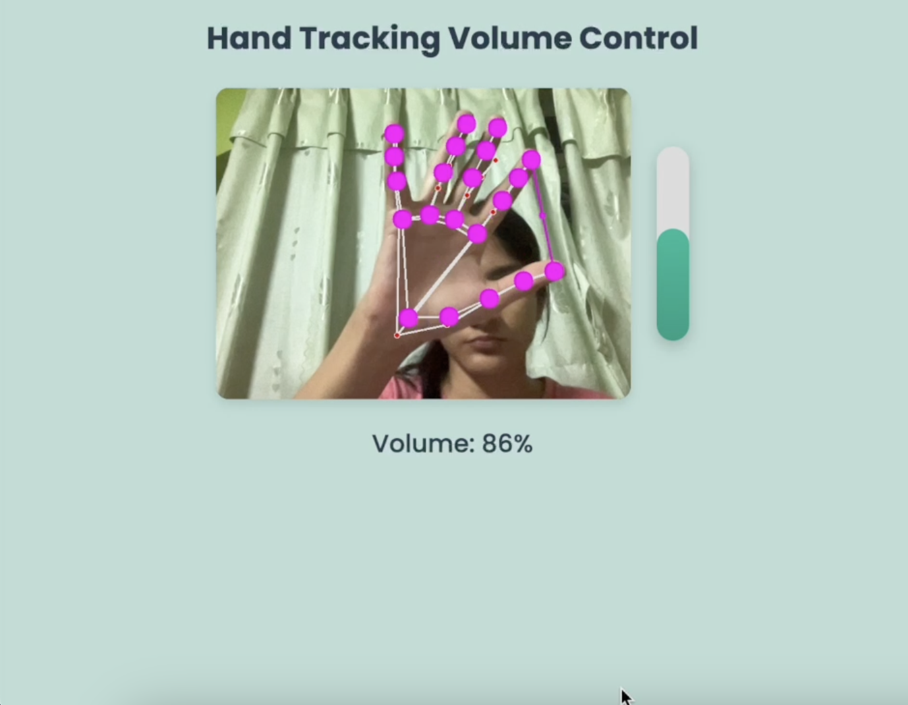

# Hand Tracking Volume Control

This project uses hand tracking to control the system volume based on the distance between the thumb and index finger. It utilizes **OpenCV** for video capture, **MediaPipe** for hand tracking, and **osascript** for controlling system volume on macOS.


## Demo

Check out the live demo video on YouTube: [Hand Tracking Volume Control Demo](https://youtu.be/mjLUV6Z-vIg)
 
## Requirements
- Python 
- OpenCV
- MediaPipe
- FastAPI
- Uvicorn
- osascript (for macOS volume control)

## Installation
1. Clone the repository:
    ```bash
    git clone https://github.com/your-repo/hand-tracking-volume-control.git
    ```
2. Navigate to the project directory:
    ```bash
    cd hand-tracking-volume-control
    ```
3. Install dependencies:
    ```bash
    pip install -r requirements.txt
    ```
4. Run the FastAPI server:
    ```bash
    uvicorn volume_control_server:app --reload
    ```

## Usage
1. Open the browser and go to `http://localhost:8000`.
2. Allow access to your webcam when prompted.
3. Start controlling the system volume by moving your thumb and index finger closer or further apart!

